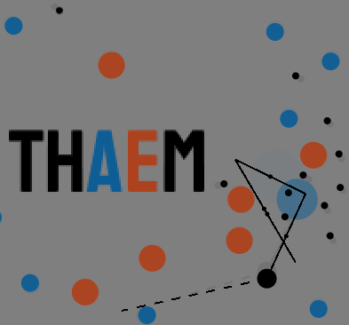

<!--  -->

# THAEM

THAEM uses waypoints to create a path for the player, which it also used to interact with enemies (bullets). The behaviour of all of the components of the game (player and the bullets) is related to the behaviour of many other components. Hence, they can be considered all to be linked together.

Made using C++ and [piksel](https://bernhardfritz.github.io/piksel/).

[Emscripten](http://kripken.github.io/emscripten-site/index.html) installed with `brew install emscripten`.

[Build instructions](https://bernhardfritz.github.io/piksel/#/gettingstarted/buildproject?id=build-for-the-web-).

Works best on Chrome / Firefox. Can also work on Safari if [WebGL 2.0](https://caniuse.com/webgl2) is enabled with `Develop > Experimental Features > WebGL 2.0`.

## Make gifs

To make the animated gif, make a `./build-osx/frames` folder, run the game with `#define SAVE_FRAMES` enabled in `game.hpp` and then run `source ../../gif_script.fish` from the `./build-osx/frames`. It's hacked together, but it isn't a core functionality so it should be fine.

The frames are saves as [Portable Pixel Map](http://paulbourke.net/dataformats/ppm/) and then converted to gif with imagemagick.

## ToDos

- [ ] ? more zen thoughts and/or death messages
- [ ] Animate creating new links
- [ ] Add subtle lightning effect to links
- [ ] Make circles slightly wobbly (so they don't just look like circles)
  - [ ] But probably don't touch the collision system
- [x] Subtle background decorations (vignette?)
- [x] Brighter background
- [ ] Animated background on itch.io
- [x] Bullet approach indicators

## Dones

- [x] Find better fonts hack
- [x] Link in itch.io
- [x] Second level to hard? Endless needs lower points ceiling. Maybe just lower points requirements in general?
- [x] bullets spawning on screen
- [x] black bullets have no path drawn on death screen
- [x] ? Color in AE in the title
- [x] package itch.io better
- [x] On-death animation
- [x] <strike>fix itch.io banner</strike> replaced with a shield
- [x] better screenshots here and on itch.io